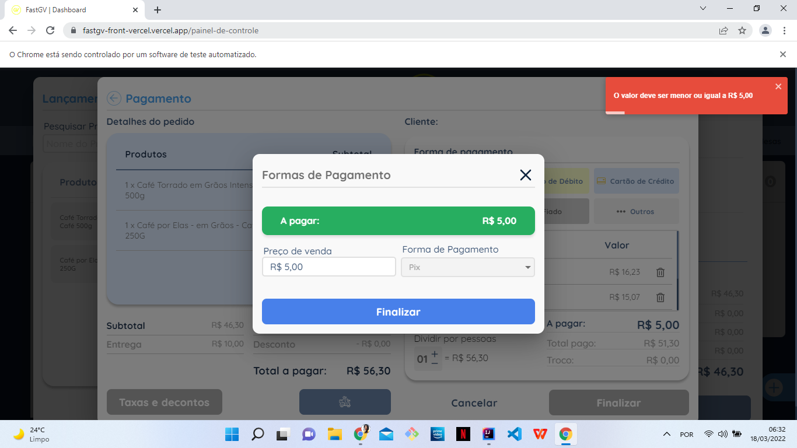

Funcionalidade: Realizar pedido  
**Eu** como Usuário 
**Quero** fazer um pedido no site FastGv  
**Para** o cliente
---
Cenário: Entrega Delivery  
**Dado** que estou logado no site FastGv  
**E** visualizo a tela "Dashboard"   
**Quando** clico em "ADD PEDIDO"   
**E** visualizo a tela de "Novo Pedido"   
**E** seleciono "Delivery"   
**E** clico no campo "Origem pedido"   
**E** seleciono uma opção    
**E** digito o nome do cliente no campo "Pesquisar cliente"     
**Então** clico em confirmar    
**E** sou direcionado a tela "Lançamento de pedido" 
---
Cenário: Entrega Retirada no local    
**Dado** que estou logado no site FastGv
**Quando** visualizo o modal "Novo Pedido"   
**Então** clico na opção "Retirada"
---
Cenário: Pedido por busca unitária    
**Dado** que estou logado no site FastGv   
**E** visualizo a modal "Lançamento de pedido"   
**Quando** digito no campo "Pesquisar Produtos" o produto específico    
**E** faço os cliques nos produtos desejados    
**E** clico em "Forma de pagamento"    
**Então** visualizo a mensagem "Produtos adicionados ao seu pedido."  
---
Cenário: Buscando por todos os produtos      
**Dado** que estou logado no site FastGv   
**E** visualizo a modal "Lançamento de pedido"   
**Quando** clico no botão "Buscar Todos"    
**E** identifico o modal com a lista de todos os produtos     
**E** clico no botão "+1" do item desejado     
**Então** visualizo a mensagem "Item adicionado!"     
**E** clico em "Confirmar"
---
Cenário: Métodos de Entrega   
**Dado** que estou logado no site FastGv no modal "Pagamento"    
**Quando** Clico no botão com ícone do motoboy    
**E** visualizo o modal "Metodos de Entrega"     
**E** clico no método escolhido e clico em "Salvar"     
**Então** visualizo a mensagem "Transportadora selecionada!"    
---
Cenário: Forma de pagamento    
**Dado** que estou logado no site FastGv  
**E** visualizo a modal "Pagamento"   
**Quando** seleciono a forma de pagamento   
**E** digito no campo "Valor a ser pago"   
**Então** clico em "Finalizar" e visualizo a mensagem "Pedido criado com sucesso!"    

**Bug** _Usuario digita o valor menor ou igual ao valor referente e consta como Erro_